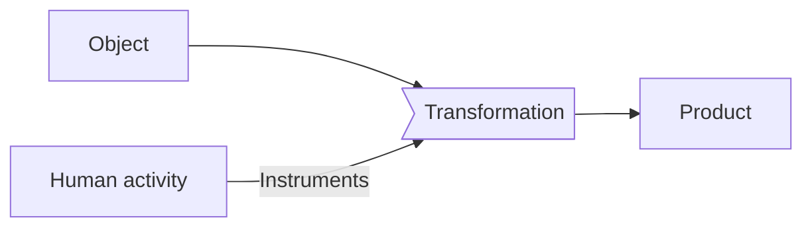
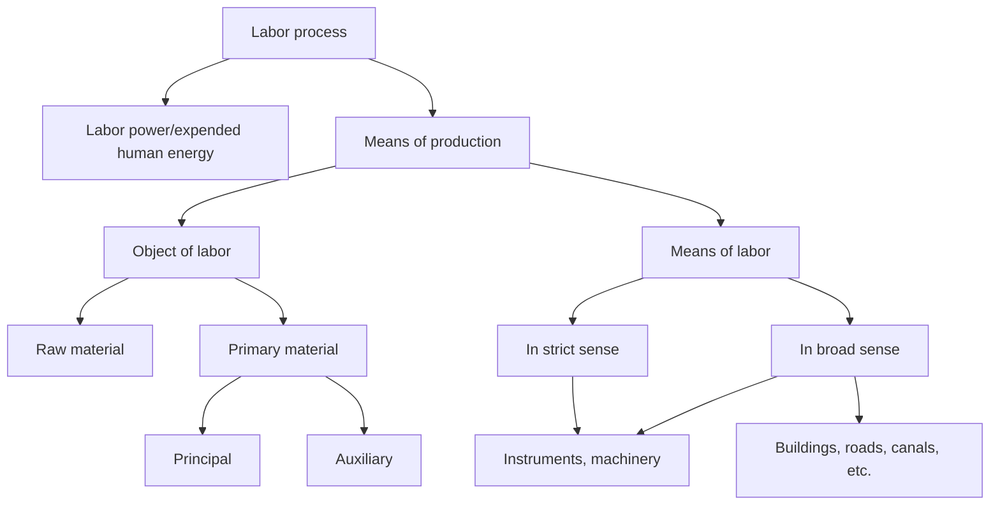

# Production

## Introduction

We begin this pedagogical exposition of the principal concepts of historical materialism with the production process, not by an arbitrary decision, but because this concept is to constitute the base on which we are going to build the theoretical edifice of historical materialism.

*For Marxism, the ultimate understanding of historical processes must be sought in the form in which human beings produce their material means of life.*

> The materialist conception of history starts from the proposition that the production and, next to production, the exchange of things produced, is the basis of all social structure; that in every society that has appeared in history, the manner in which wealth is distributed and society divided into classes or orders is dependent upon what is produced, how it is produced, and how the products are exchanged. From this point of view the final causes of all social changes and political revolutions are to be sought, not in men's brains, not in man's better insight into eternal truth and justice, but in changes in the modes of production and exchange. They are to be sought, not in the *philosophy*, but in the *economics* of each particular epoch[^1.1].

Now then, all production is characterized by two inseparable elements: *the labor process* which is the transformation of nature by human beings to convert it into a useful object and the *relations of production* which are the concrete historical form in which the labor process is realized.[^1.2]

## The Labor Process

*The **labor process** is any process of transformation of a definite object, either natural or already worked upon, into a definite product, a transformation effected by a definite human activity, using definite instruments of labor.*

The moment of transformation is the determinant moment, the most important moment of the labor process. The labor process refers to when the object undergoes a process of transformation in order to be converted into a useful product. This transformation is realized through the activity of human labor utilizing more or less developed (from the technical point of view) instruments.

This labor process was studied by Marx in the first volume of *Capital*. Relying on it, we can now redefine in a more precise manner the different elements which are a part of this process.

## The Elements of the Labor Process

These elements are, as we see them: a) the object of labor, b) the means of labor, and c) the human activity used in the process.

### The object of labor
We must distinguish two types: raw material and primary material.

***Raw material*** is the substance which comes directly from nature, which is untouched by labor.

Examples: trees in the forest waiting to be cut down; minerals to be extracted from the mines, etc.

***Primary material*** is the substance which has undergone some modification as a result of labor.

Examples: cut wood, refined ores, etc.

Now then, primary materials can constitute the principal element of a product or they can intervene only as auxiliary materials.

*Auxiliary primary materials* are those which:

- can be absorbed by the instruments of labor themselves; coal or electricity for the machinery, oil for the wheels, etc.
- can be incorporated in the principal primary material to produce in it a transformation of a material character: dye in leather or wool, chlorine to bleach fabrics, etc.
- can serve simply in the execution of labor as in the case of materials destined to illuminate or heat the places where work goes on.

In the true chemical industries the distinction between principal and auxiliary primary materials is blurred, since, in the final product, none of the primary materials employed appears.

### The Means of Labor

What Marx called the means of labor can be defined in a strict and in a broad sense.

***The means of labor in a strict sense** are the things or the conjunction of things which the laborer interposes directly between himself/herself and the object of labor (raw or primary material). They serve as intermediaries between the laborer and the object of labor.*

Examples: the hammer and saw in a small furniture factory, the sewing machine for a tailor, the mechanized shovel in mining, etc.

***The means of labor in the broad sense** encompass, in addition to those means mentioned above, all the material conditions which, without intervening directly in the process of transformation, are indispensable for its realization.*

Examples: land, factories, roads, canals, irrigation projects, etc.

Owing to the fact that the production of material goods can not be realized without the participation in it of both primary (or raw) materials and the means of labor in the broadest sense, Marx called these elements *means of production*. 

***The means of production** are constituted by the objects of labor and the means of labor in the broadest sense.*

It is necessary to point out that in many Marxist texts the term "means of production" is used to designate what Marx defined as "means of labor." This notion can lead to misunderstandings.  

### Human Activity Realized in the Production Process

The human activity developed in the process of production of material goods is called, commonly, labor. This labor, which is expressed in a certain quantity of products implies the expenditure of a certain quantity of human energy.

*Marx called the human energy expended in the process of labor **"labor power"***.

The fatigue after a day at work is only the physical expression of this expenditure of energy, the production of human activity developed during the labor process. Good food and rest permit this energy to be renewed.

The concept of *labor* should not be confused with that of *labor power*. Each one refers to absolutely different realities. One example to make the difference clearer: in the same manner that a machine does a definite amount of "labor" in a certain number of hours (canning a definite amount of vegetables) and to achieve this end uses a certain quantity of electricity, a worker in a noodle factory in eight hours of work daily succeeds in packaging a definite quantity of kilos of noodles and, to accomplish this end, expends a certain quantity of human energy. Therefore, the human energy or labor power is radically different from the realized labor, which is only the expenditure of that labor power.

By confusing the two concepts the classical economists were incapable of discovering the origin of capitalist exploitation. They held that wages were the price of the labor realized by the worker, but when they calculated how much they ought to pay him/her, they totally forgot this declaration and instead of calculating the price of the labor realized (number of shoes made, for example) they calculated the price of the objects which the worker had to consume to restore his/her labor power (not only material objects such as: food and shelter for him/herself and his/her family; but also cultural objects: radio, movies, sports, etc.).

### The Product: the Result of the Labor Process

*The final object created in the labor process is called the **product**.*

The product has use value.

*Any object which corresponds to a definite human necessity (physiological or social) is said to have **use value**.*

However it is necessary to point out that although generally every product has use value, since if it did not there would be no justification in producing it, not everything with use value can be defined as a product. Objects exist which correspond to human needs without having undergone a previous process of transformation. This is the case with air, which corresponds to the need for breathing. It has use value but it is not a product.[^1.4]

## The Role of the Means of Labor in the Labor Process

In sum: any labor process is a structure formed by three fundamental elements: labor power, the object of labor and the means of labor, which are linked together in definite relations. Now then, the most significant elements in the labor process are the means of labor in the strict sense. They determine the type of activity which the individuals must carry on for the production of the products, determining in this way the type of relationship which is established between the laborer and the means of production.

Agricultural labor, for example, changes completely when the tractor is introduced. In place of requiring 20 laborers to work the land, with their shovels and hoes, now a single person is enough to drive the tractor and produce the same yield. In this way labor ceases being fundamentally manual. This explains Marx's affirmation:

> It is not the articles made, but how they are made, and by what instruments that enable us to distinguish different economic epochs.[^1.5]

Now then, although the means of labor are the determinant elements in the labor process, they do not always occupy a dominant place in the structure of this process. In countries with a low technological level, for example, labor power occupies the dominant place. This is the case in primitive and slave societies and, in general, in the so called "underdeveloped" societies. A different situation exists in advanced capitalism, where the kind of means of production employed -- highly developed machinery -- dominates the entire process subordinating the laborer to its rhythm, converting him/her into an automaton of production.

## Labor Process and Production Process

Until this point we have studied the labor process concentrating on the simple and general elements which are part of it, without concern for the concrete historical conditions in which this process develops. To do so we need to present the laborer in relation to other laborers.

Now then, Marxism holds that human beings are not alone and isolated in their struggle to transform nature, that to create the labor process they establish definite relationships among themselves: relations of mutual aid and collaboration, relations of exploitation, or relations of transition between both extremes. These relations which human beings establish among themselves in the labor process are what determine the character which this process assumes in an historically determined society.  A great difference exists between labor conducted under the whip of the overseer of slaves and the labor carried out under the watchful eyes of the capitalist.

Marx called these relationships *relations of production* and insisted that every labor process goes on under definite relations of production, that is, that the form in which human beings transform nature is never isolated, but on the contrary, is determined by the type of relations which they establish in the labor process.

*We call the **production process** the labor process which goes on under definite relations of production.*[^1.6]

This distinction between labor process and production process explains why Marx refused to speak of production in general.

For Marx, production in general did not exist; production is always historically determined.[^1.7]

## Division of Labor

In any social production there exists a division of tasks, that is, a division of labor. The greater the complexity of society and the higher its level of development, the greater the differentiation of tasks.

We must distinguish the following different types of division of labor: division of social production, technical division of labor and social division of labor.

*We call the division of social production into different wings, spheres or sectors the **division of social production.***

Examples: division between agricultural labor and industrial labor; divisions within industrial labor (metallurgy, chemical, textile, etc.); division between industrial and commercial labor, etc.

*We call the division of labor within a process of production itself the **the technical division of labor***.

This technical division of labor is especially developed in modern industry. Each worker or group of workers does a specific job which corresponds to one part of the process. In the automobile industry, for example, different sections exist which compliment each other until in the end a finished car is produced. Here no worker produces a final product. What is converted into a finished product is the common product of all of them. This technical division of tasks within a process of production permits greater efficiency and therefore, a greater expenditure of labor by workers.

Now then, the technical division of labor can lead to the division of social production. This is the case with chemical activity which began as a simple technical division in the process of production of textiles and was later converted into an autonomous wing, into a true chemical industry.

How then do we clearly distinguish between the technical division of labor and the division of social production?

Marx gives us the fundamental elements of an answer in the body of *Capital* when he refers to the division of labor and manufacture.

What characterizes the technical division of labor is that the specialized, isolated laborers do not produce commodities, that is, use values which can be taken to market to be exchanged for others. What each specialized worker produces is only a part of the final product. Only that which is the result of a collective labor constitutes a commodity, that is a use value exchangeable in the market.

This is why chemical activity, which was born as a specialized labor but within the textile industry, should be considered in this case within the technical division of labor. The objects which this activity produces do not go to market, but pass directly into the process of dyeing cloth.

But the same thing does not occur when chemical activity becomes independent of the textile industry and constitutes itself as an autonomous industry. In this case its products go to market and not directly to a definite process of production. In this case the technical division has constituted itself into the division of social production.

Finally we should be clear that the technical division of labor does not refer only to the division of labor within one factory. It is not the same to speak of the division of labor within a production process as it is to speak of the division of labor within the factory itself.

As the development of the productive forces advanced and their social character matured, units of production which had previously constituted part of the division of social production came more and more to depend on each other, in such a way that the relations between them could no longer be left to the hazards of the market which once determined the operations of production. From then on these relations in essence had to be determined beforehand, and therefore, predicted with anticipation and ruled by a plan. When this occurs the future of the products is predetermined in a socially conscious manner, eliminating in this way the role of the market. The units of production, in place of constituting a process of autonomous production, "became cells of the technical division of labor" thus elevated to a higher level.[^1.8]

This happens, for example, when industrial combinations are produced in the socialist countries. Petroleum extractive industries, refineries, and distribution enterprises constitute a single process of production in which the units of production represent only a technical division of labor. Only the final product of this combined process of production reaches the market. In the previous stages there is neither buying or selling, only the transfer of a product from one unit of production to another in accordance with a pre-established plan.

*We call the **social division of labor** that distribution of the different tasks which individuals perform in society (economic, political and ideological tasks) and which are carried out as a function of the place which they occupy in the social structure.*

This social division of labor began historically with the division between manual labor and intellectual labor. Only individuals who came from the dominant classes had access to the latter.

Let us see the way this social division exists in the process of capitalist production. In this process there intervenes, for example, specialized workers, technicians and engineers who perform definite technical functions. Now then, the distribution of individuals from society into these different tasks does not depend on purely technical criteria (better aptitude, greater preparation) but on social criteria. Certain social classes have access to certain tasks, other classes do not.

It is the social relations of production, as we will see later on, which determine this social division of labor.

## Summary

In this chapter we have defined what is meant by the labor process, the principal elements which form part of it, and the importance of the means of labor in the production process, the difference between the labor process and the production process, and finally, the form in which labor is divided in society.

We have seen the following concepts of the general theory of historical materialism: 

- production
- labor power
- raw material
- primary material
- principal primary material
- auxiliary primary material
- means of labor in the strict sense
- means of labor in the broad sense
- means of production
- social division of labor
- division of social production
- technical division of labor

### Questions
1. What is meant by labor?
2. What is the essence of the labor process?
3. Can hunting and fishing be considered as labor processes?
4. What is meant by labor process?
5. What is meant by labor power?
6. What is meant by raw material?
7. Can the copper which is used to make electrical cables be considered as primary material?
8. What is meant by primary material?
9. What is meant by principal primary material?
10. What is meant by auxiliary primary material?
11. In what kind of industry can principal and auxiliary primary material be confused?
12. What is meant by means of labor?
13. Why can we not use the word "instruments" to designate the means of labor?
14. Can we consider a bridge to be a means of labor?
15. Why are the means of labor the determining element in the labor process?
16. What is the precise definition of the concept "means of production"?
17. Can there be labor without means of production?
18. What is the difference between labor process and production process?
19. How should we understand Marx's statement that "production in general" does not exist?
20.  What is meant by division of social production?
21.  What is meant by technical division of labor? 
22.  Can we speak of technical division in the labor of an artisan (for example, of a weaver of shawls, of a carpenter who makes small quantities of furniture)?
23.  What is meant by social division of labor?

### Themes for reflection
1. How is the minimum wage of a country calculated?
2. If the capitalist has an interest in making the worker labor for as many hours as possible, how can we explain the fact that in the majority  of capitalist countries the work day is eight hours? Why in some socialist countries is it only six hours?
3. What would it mean if the workers were the masters of the means of production?
4. In the Latin American capitalist societies, to whom do the means of production belong?  
5. Is the technical division of labor of advantage or disadvantage to the workers?

## Bibliography
- Marx, Karl. Chapter VII of *Capital*, "The Labor Process and the Process of Producing Surplus Value".
- Bettelheim, Charles. *Economic Calculation and Forms of Property*, (MR, 1977) pp. 57 and thereafter.
- Althusser, Louis, various works.
- Marx, Karl. Chapter XIV, section 4 of *Capital*, "Division of Labor in Manufacture and Division of Labor in Society".

[^1.1]: Engels, *Anti-Duhring* (Foreign Languages Publishing House, 1962), p. 365
[^1.2]: In previous editions we did not differentiate between the "labor process" and the "production process" in the process of transformation of nature. Now we are convinced that it is necessary to distinguish between the two, since, as we see in this chapter, the basis of the production process is the reproduction of its conditions of production, while a labor process can go on without having this end.
[^1.3]:  Louis Althusser, *Reading Capital*, chapter 9.
[^1.4]: Whenan object is produced, not for its direct consumption, but for its exchange with another in the market, it is called a *commodity*.
[^1.5]: Marx, *Capital*, (International, 1967), volume I, p. 180.
[^1.6]: This definition will be better understood in studying the chapter on relations of production. In it we will see how the production process tends to reproduce as much its material conditions as its social conditions of production, that is, the relations of production. The distinction between labor process and production process we owe to reading Bettelheim's book: *Economic Calculation and Forms of Property*, (MR, 1975).  
[^1.7]: "Thus when we speak of production, we always have in mind production at a definite stage of social development…" Marx, "Introduction" A *Contribution to the Critique of Political Economy*. (International, 1970), p. 189
[^1.8]: Charles Bettelheim, *The Transition to a Socialist Economy*, (Harvester Press 1975).
