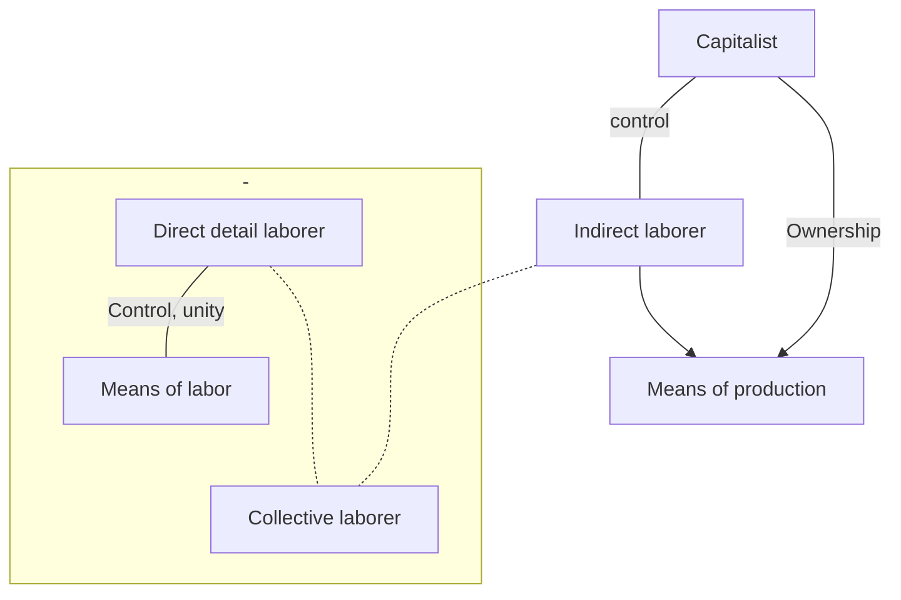
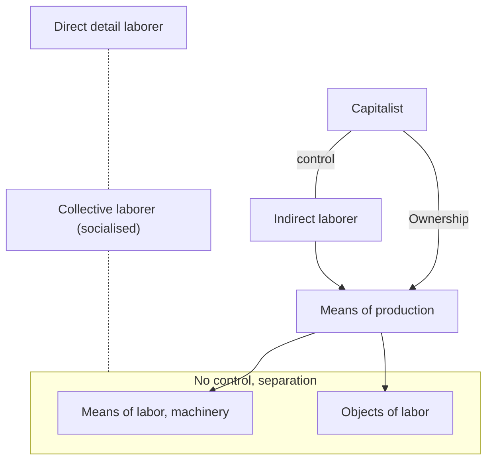

# Production Relations

## Introduction

In the previous chapter we saw the simple elements which form part of the
total labor process; in this chapter we will study the relations of production
which are the historical form in which this process is realized. In any production
process definite relations are established between the different agents
of production.

*All the individuals which in one manner or another participate in the process
of production of material goods are called **agents of production**.*

The relations between the agents of production can be grouped into technical
relations of production and social relations of production.

First let us examine each of these relations separately before studying
them in the inseparable unity in which they exist in manufacturing and large
scale industry.

## Technical relations of production

To clarify what we mean by technical relations we begin by distinguishing between two types of labor processes: individual and cooperative. The *individual labor process* is realized by a laborer working in isolation, transforming a definite primary material into a definite product. This is the case of the artisan or the small peasant producer. The *cooperative labor process* is realized through the participation of various laborers. We can distinguish two
forms of cooperation:

1. *Simple cooperation* in which all the laborers realize the same tasks or very
similar tasks. This form of cooperation occurs in the hunting operations of
primitive peoples in which a group of hunters armed with spears attempt to surround
an animal. It continues to occur today in technically undeveloped agricultural
labor.
2. Complex cooperation which is established on the basis of a technical division
of labor. For example in the process of sowing, some laborers make the
furrows, some plant the seeds, etc.

The fundamental characteristic of the individual labor process is the existence
in it of the unity of the laborer and his means of labor. The quality and the output of the labor of the artisan depends on the personal ability with which he/she handles the instruments of labor. He/she controls or exercises absolute domination over the entire labor process, deciding when, how and where he/she ought to work.

The *cooperative labor process* is fundamentally characterized by the existence
of common social labor, which if it is carried out on a sufficiently wide
scale requires a directing force to put the different individual activities
into harmony with each other. This directing force must fulfill the general
functions which arise from the difference between the general motion of the
production process and the individual movements of those who form part of this
process.

Marx said in this respect:

> In all forms of labor in which many individuals cooperate, the cohesion and unity of the process is personified necessarily in a volition to command and in functions which do not effect the partial labors but only the total activity of the workshop, as occurs with an orchestra director[^2.1].

In the case of a capitalist industry -- a shoe factory for example -- not all
the workers carry out the same tasks within the production process. Some work
directly on the transformation of the primary material, that is leather, in our
example, to convert it into a final product, a pair of shoes ready for sale.
However, in order that these direct laborers, specialists in only one part of
the process of production, be able to effect a coordination of labor, the participation
of other persons capable of controlling and directing the process of
production, either partially or totally, is required.

Both types of labor are necessary to set the means of production into action.

Any process based on large scale cooperation, implies, therefore that the
individual laborers lose control or domination of the labor process. Thus a
separation is produced between the individual laborer and the totality of the
labor process. This process is no longer set into motion by the individual
laborer, but by the collective laborer which requires as one of its elements
a group of laborers which carries out the functions of direction and control
of the labor process. Together with the function of direct transformation of
the primary material arises the function of direction and control of the total
labor process[^2.2].

***Direct laborers*** *are the agents of production who are in direct contact with the
primary materials, and **indirect laborers** are those who have a function of organization,
vigilance, and control, at distinct levels of the labor process.*

Up to this point we have spoken of the common character of all forms of
cooperation: *the existence of a collective laborer out of which arises definite
functions of direction, and control of the labor process*.

Now let us look at some of the different characteristics which depend on
the different types of relations which are established among the elements of
the production process.

A cooperative process of production can exist which implies a *unity between
the laborer and the means of labor*. That is, in which the laborer in the
collective form implies a control or domination on the part of the individual
laborer over the instrument of labor. In this case there is a *separation* of
the individual laborer with respect to setting into motion the labor process,
which now is in the hands of the collective laborer, but a *union of this laborer
with the means of labor*, his personal ability being considered.

Another type of cooperative production process can exist in which the individual
laborer has lost not only domination over the setting into motion of
the labor process, but also over the means of labor, as occurs in large scale
industry, where the laborer becomes one more piece of machinery.

Under these conditions a new unity is constituted, which replaces the unity
of the laborer with the means of labor already examined, *the unity of the
means of labor with the object of labor*. It is the machinery which transforms
the primary materials, the laborer becomes its slave. This object-machinery unity constitutes, according to Marx, "a material skeleton independent of the
workers" and becomes a faithful element of a labor process ready to receive
whatever worker comes along. In this way a total separation is produced between
the individual laborer and the means of production. The need for the
collective laborer becomes a technical necessity. The collective laborer is
transformed into a *socialized laborer*.

On the basis of what we have seen we can state that the type of relationship
which is established between the individual laborer and the means of labor
depends fundamentally on the characteristics of these means of labor. Hence
Marx insisted on *the decisive role which the means of labor play* in the concrete
historical forms which the labor process takes.

In summary, in any production process there is established a definite type
of relationship between the agents and the means of production, a relationship
in which they are linked by the technical characteristics of the labor process:
technical division of labor, type of cooperation, technical characteristics of
the means of labor, etc. These relationships are characterized by the type of
control or domination which the agents of production can exercise over the means
of labor and the labor process.

***Technical relations of production*** *are the forms of control or domination which
the agents of production exercise over the means of labor in particular and
the labor process in general.*[^2.3]

## Social Relations of Production
Up to now we have seen the technical forms in which the production of material
goods is carried on. The direct laborer and the indirect laborer are
agents of production which expend their labor power in technically different
tasks, which depend on the *technical* division of labor within the productive
process.

But this *technical* process of production never exists in isolation from
the *social conditions* which make them possible. All social production is historically
determined.

In a concrete society it is possible to observe, in general, that there
exist individuals who are owners of the means of production and individuals
who must work for the others: *the laborers*.

The *laborers or direct producers* are immediate agents of production, in
short, those who expend their labor power inside the production process itself.
From the technical point of view they are divided, as we have seen, into direct
and indirect laborers.

In the societies in which the private ownership of the means of production
exist, the *owners of the means of production* play a role in the general process
of production, without necessarily figuring as direct producers, since being
masters of the means of production makes the process possible. Since means of
production are the indispensable material conditions for production, and since
it is impossible to produce without them, persons who do not possess these means,
or possess too small an amount of them, end up working for those who own the
fundamental means of production.

### The Agents of Production
If we call *agents of production* all those who participate in one way or another
in the process of production of material goods, we can then classify these
agents from two points of view:

1. From the *technical point of view*: direct laborers and indirect laborers.
2. From the *social point of view*: workers, who do not own the means of production, and owners of the means of production.

It is important to indicate that this is a matter of two points of view for the
study of the same agents of production, and not of the technical or social tasks
to be completed by different agents.

Each agent of production is thus doubly determined. The agent is determined
as much by his/her technical function as by his/her social function. If
we take the capitalist system as an example we see that: the worker is, from a
technical point of view, a direct laborer, and from the social point of view,
a laborer without the means of production. The capitalist in turn is, from the
point of view of his/her social function, the owner of the means of production,
and from the technical point of view, can play the role of an indirect laborer
(administrator), as occurs in small industries where the owner and family work,
or he/she can play no role in the process of production itself, being in this
case a non-laborer. On the other hand the supervisor can also be considered
from these two points of view. From the technical point of view, he/she is
an indirect laborer and, from the social point of view, he/she is a non-owner,
who, nevertheless, as we will see later on, fulfills within industry the social
function of the capitalist.

It is important to know that if each agent of production is doubly determined
by the technical and social functions he/she fulfills in the process of
production, the latter function has the dominant role. The technical function
of vigilance, control and direction of any total production process has, for
example, a very different character when it is subordinated to capitalist relations
of production, than when it is subordinated to socialist relations of
production.

### Right of Ownership, Real Ownership and Effective Possession

Up to this point we have spoken of property but we have not said what we
understood by it. Let us now begin to define this concept, starting by defining
what we mean by right of ownership.

*Right of ownership* is the right which one who possesses goods has to use,
to enjoy and to dispose of them. Let us explain each of these terms:

- *The right to use*, that is, to make use of goods which one possesses in accord
  with their natural characteristics. For example: to use land is to cultivate
  it; to use a vehicle is to drive it.
- *The right to enjoy*, that is, the enjoyment of the fruits which these goods produce.
  For example, to enjoy the fruits obtained from the cultivation of the
  land.
  The right to use and enjoy these goods is called usufruct in law.
- *The right to dispose of*, that is, to assign goods one possesses to definite ends or to delegate this right to third persons.

This right of ownership can arise from simple collective consent motivated
by political or ideological reasons, or can take on finished juridical
forms[^2.4]. Moreover its content varies according to the different historical
epochs. The content of the right of ownership characteristic of modern western
society cannot be applied therefore, in a mechanical way, to any other
type of society. The concept of private property characteristic of the capitalist
system of production cannot be applied to feudal society.

In the feudal system distinct grades of private property existed: "eminent
but not effective ownership by the most powerful persons" in the feudal
hierarchy ''over immense terrain; direct but not absolute ownership, since it
was linked to obligations and services to the small and middle sized lords.
This hierarchy of rights to the land was imposed on the base of feudal society,
that is to say, on the exploited peasants."[^2.parain]

It is important to distinguish between a *right of a juridical character*
and the *real power* to use, enjoy and dispose of goods.

Let us see how this statement is applied to the problem of the ownership
of the means of production. We distinguish between the *right of private ownership*
of the means of production, and the *real ownership* of them. When the
right of ownership is transformed into a real *power* to use, enjoy and dispose
of the means of production, and consequently of the products resulting from the
process of production, we say that there exists *real ownership*.

In order that this real ownership exist it is necessary that whosoever
holds this power be able to set into motion the process of production. Therefore,
in this case, a definite type of control over the means of production
must be combined with a definite type of dominion or control over the labor
process. Juridical ownership necessitates, consequently, a definite technical
base, that is, a definite structure of the labor process, in order that it be
transformed into real ownership.

We can see here *how the technical relations and the social relations of
production interpenetrate in an inseparable manner; how the technical relations
serve to support the social relations, which in turn act on them giving them
their specific historical character.*

***Effective possession*** *is the capacity which the owners of the means of production
have to put-them into motion.*

*In summary, there exists **real ownership** of the means of production when effective
possession of these means and the power to dispose of them and the products
they produce are united in the same hands.*

\begin{gather*}
\textit{real ownership (of MoP)} \\
= \\
\textit{power of disposition (of MoP and the product thereof)} \\
+ \\
  \underbrace{\textit{possession and dominion (of MoP)}}_{\textit{effective possession}}
\end{gather*}

When the juridical owners of the means of production have real ownership
of them, the direct producers are totally separated from these means of production:
they are non-owners who have lost all dominion over the means with which
they work and over the total labor process[^2.5].

It is this relationship of ownership/non-ownership which the agents establish
with the means of production which explains the relationship of exploitation
which is established between them. The relationship of the agents to the
means of production therefore determines the relationship of the agents to each
other.

### The Concept of Social Relations of Production
As a result of what we have said above, we can define the social relations
of production in the following manner:

*We call **social relations of production** those relationships which are established
between the owners of the means of production and the direct producers in a
definite process of production, relationships which depend on the type of
ownership relation, possession, dispossession or usufruct which they establish
with the means of production.*

We can distinguish two fundamental types of social relations of production
which depend on two forms of ownership of the means of production.

a. *Relation of exploiter-exploited.* It exists when the owners of the means of
production live off the labor of the direct producers.
The principal relations of exploitation are the following: *the relations
of slavery*, in which the master is not only owner of the means of production
but is owner also of the labor power (the slave); *the relations of servitude*,
in which the master is the owner of the land, and the servant depends on him
and must work gratuitously for him a certain number of days of the year; and
finally, *capitalist relations*, in which the capitalist is the owner of the means
of production and the worker must sell his labor power in order to live.

b. *Relations of Reciprocal Collaboration.* These relations are established when
there exists a social ownership of the means of production and when no sector
of society lives off the exploitation of another sector. For example, the relations
which are established between members of primitive communities or the
relations of collaboration which, according to Marx, characterize the communist
mode of production.

## The Relations of Production in Manufacturing and Large Scale Industry
\sectionmark{Manufacturing and Large Scale Industry}

In this section we will study how the technical and social relations of
production form an inseparable unity in definite processes of concrete production
such as manufacturing and large scale industry.

### Manufacturing

*Capitalist manufacturing* was born when a capitalist, an owner of means of
production (instruments of labor, a building, etc.) brought together a relatively
large number of workers who labored at the same time, in the same place and under
the command of the same capitalist.

Marx said that the conditions necessary for this occurrence are fundamentally
two: a certain quantity of money accumulated by a sector of the population:
the capitalists, and the presence of a free laborer dispossessed of all
means of production, who, in order to subsist, has to sell his labor power to
the capitalist who possesses those means.

In manufacturing, labor primarily takes the form of simple cooperation.
Each laborer carries on the same operation with the sole difference that now
he/she labors in common with other laborers. Because of this Marx says that
the difference between the artisan's workshop and manufacturing is, in the beginning,
purely quantitative. The essential characteristic of both processes
of labor is *the unity which exists between the laborer and the means of labor.*

Manufacturing which began as nothing more than simple cooperation, but
subject to the capitalist as owner of the means of production, evolved rapidly,
impelled by the desire to augment capitalist profits, into new forms of cooperation,
each time more complex. Thus was born the technical division of labor
within manufacturing. Laborers became specialized among various tasks in
accordance with their aptitude. These tasks took on each time a more partial,
more limited character.

The technical character of labor in manufacturing, therefore, has two
fundamental characteristics: it is primarily *manual labor* which depends in great
measure on the force, ability, safety and speed of the form in which the worker
manages his tools of labor. In the second place it is *detail labor*, that is to
say, labor in which each worker is specialized in a very specific task and only
the sum of all these labors comes to constitute the total object. This has
positive effects since it implies an increase in labor efficiency: with the same
effort, in the same time, more products are produced. But it also has negative
effects: the laborer is reduced to only one set of motions such that his/her
body becomes deformed in order to better respond to the highly specialized manual
activity which he/she must carry on.

The simple elements of manufacturing are, therefore, the *detail laborer*
and the *instrument of labor*, These simple elements are combined in a *specific
mechanism* which is the *collective laborer* formed by the conjunction of *detail
laborers*.

The existence of this collective labor, in which each laborer fulfills
highly specialized tasks, makes necessary the existence of a directing force to
harmonize the distinct individual activities and execute the general functions
necessary for the setting into motion of the total production process.

This function of control, vigilance, and direction is converted into a
*function of capital* as soon as the labor subject to it assumes the form of collective
labor.

This function which was born as one of the many tasks of the collective
laborer is separated from it and is transformed into a function which dominates
it and crushes it. The collective laborer thus loses all domination over the
labor process.

The important thing is to study the form in which this function, by itself
of a technical character, is overdetermined by the social function which capital
plays.

Since the capitalist process of production has as its fundamental goal
to increase surplus value (unpaid labor), the directing role that the capitalist
(or one of his/her representatives) performs in the production process is not
limited solely to the fulfillment of technical tasks, but at the same time,
these same technical tasks of control, vigilance, and direction are overdetermined
by the necessity of extracting the maximum of surplus value. The indirect
laborers are transformed into enforcers within the production process, they
demand from the workers the maximum output, thus increasing beyond the technical
necessities, the burdens of vigilance and control to prevent the workers from
obtaining the return on their labor, etc.

Let us see what Marx said on this problem:

> If then, the control of the capitalist is in substance two fold by reason of the two fold nature of the process of production itself, which, on the one hand, is a social process for producing use values, on the other, a process for creating surplus value in form that control is despotic. As cooperation extends in scale, this despotism takes forms peculiar to itself. Just as at first the capitalist is relieved from actual labor as soon as his capital has reached that minimum amount with which capitalist production, as such, begins, so now, he hands over the work of direct and constant supervision of the individual workmen, and groups of workmen, to a special kind of wage laborer. An industrial army of workmen, under the command of a capitalist, requires, like a real army, officers (managers) and sergeants (foremen, overlookers), who, while the work is being done, command in the name of the capitalist. The work of supervision becomes their established and exclusive function… It is not because he is a leader of industry that a man is a capitalist; on the contrary, he is a leader of industry because he is a capitalist. The leadership of industry is an attribute of capital, just as in feudal times the functions of general and judge were attributes of landed property[^2.6].

Therefore, we have in manufacturing a definite combination of technical
and social relations which is the following: the capitalist is at the same
time the owner and the one who controls (personally or through his/her representative)
the process of production in its totality. The laborer is not
the owner of the means of production but he/she still controls the management
of the means with which he/she works. Remember that the characteristic of
manufacturing is the unity which exists between the laborer and the means of
labor. There still does not exist the total domination of all the elements
of the production process on the part of the capitalist.

Diagram #2: Manufacturing 



In the stage of manufacturing the juridical ownership of the capitalist
of the means of production still does not correspond to a full real ownership
of them. Labor, still depending on the skill of the worker, is not totally
subordinated to capital.
The Capitalist, many times, must give way before the
pressure of the laborers
in order lo not lose a skilled laborer, who has succeeded
in increasing his output
thanks to his/her long experience in specialized
manual labor.

Now then, in a definite moment in the development of the capitalist mode
of production, the technical base of manufacturing: *the unity of the detail
laborer and the instrument of labor*, which implies that the output of the labor
is limited by the physical capacity of the laborer, comes into contradiction
with the necessity of capitalist accumulation.
In this manner manual labor is
replaced by mechanized labor realized by means of the machine.

### Large Scale Industry

*Large scale capitalist industry* is different from manufacturing. The
difference is the function which the means of labor has acquired within it.
The revolution in which the means of labor lead to a revolution in the general
process of production is the so-called *industrial revolution*,

Of what did this revolution consist? In the introduction of machine-tools
in the production process. These machines integrated into a technical unity
the apparatuses and tools with which the manual worker labored in manufacturing.
They ceased being implements in the hand of laborers and became "implements
of a mechanism or mechanical implements."[^2.7]

Marx defines the mechanical implement or machine-tool as "a mechanism
that, after being set in motion, performs with its tools the same operations
that were formerly done by the workman with similar tools… From the moment that
the tool proper is taken from man, and fitted into a mechanism a machine takes
the place of a mere implement."[^2.8]

The machine-tool thus made it possible to overcome the organic barrier
which had arisen between the laborer and the means of labor in manufacturing
and to increase production considerably as a result.

This completely transformed the relationship between the laborer and the
means of production. The setting into motion of the means of labor in manufacturing
no longer depended on the personal aptitude of the laborer. The
organization of production becomes completely independent of the characteristics
of the power of human labor.

A complete separation is established between the laborer and the means
of labor. At the same time a unity is established between the means of labor
and the object of labor.

The process of production can no longer be defined as the coming together
of a certain number of workers, but as a conjunction of machines ready to
receive whatever worker comes along.

Capital, which began by seizing upon the labor process in the technical
conditions given by historical development, and subject to the laws of capitalist
accumulation, revolutionized totally the labor process. Until that moment, said
Marx, there had only been a formal subjugation of labor to capital. Now, with
the introduction of the machine-tool, there existed a real subjugation.

Collective labor becomes here a technical necessity and is converted, according
to Marx, into *"socialized labor"*. It now becomes harder and harder to
distinguish the role played by each individual laborer in the production of the
final product[^2.9].

The character each time more socialised, of the structure of the labor
process (and the relations within it) comes into contradiction with the private
character of the real ownership of the means of production, that is, it comes
into contradiction with the relations of production.

We have, therefore, in large scale industry, the following combination
of the technical and social relations of production: the capitalist is at the
same time the owner of and the one who controls and directs (personally or
through his/her representative) the total production process. The individual
laborer, on the other hand, finds him/herself totally *separated* from the means
of production: he/she is neither its owner nor has any control over them, and
as a result finds him/herself totally subordinate to capital, socially and
technically.

This coincidence of social and technical relations of production, of
relations of ownership and real appropriation, to use Marx's terminology, which
transforms the juridical ownership of the capitalist into a real ownership and
totally separates the laborer from the means of production, is what makes.the
character of the process of capitalist development in this stage totally irreversible.

It is no longer possible as it was in the stage of manufacturing
for the manual laborer and the worker to leave the factory and return in one
way or another to the old artisanal production. This has occurred with some
agrarian reforms in which the process of collectivisation of the land has not
been accompanied by the creation of a corresponding technological base. The
methods and techniques of individual labor is still maintained, only now they
are carried on within the terrain of collective ownership. Any political
retreat can lead, in this case, to a turning backward in agricultural production
toward independent small ownership.

Diagram #3: Large scale industry


After having analysed the form of the union of technical and social
relations of production within capitalist manufacturing and large scale industry,
we can better understand in what way the social relations of production
play a dominant role in this process, provoking a change in the technical structure
of the process.

It is the desire to increase its wealth which drives capital to seek
new formulas to augment the amount of surplus value. Since it cannot increase
the length of the work day, which has a physiological limit and a political
limit imposed by the struggles of the working class, it becomes necessary to
succeed in diminishing the part of the work day dedicated to pay for the labor
power of the worker, thus increasing the unpaid part or the work day which
the capitalist appropriates for him/herself.

For this to happen capital must seek forms of increased productivity of
labor by increasing its intensity (the Taylor system, etc.[^izzy]) and replacing manual
labor with machine labor.

The technical relations of large scale industry have originated in and
been overdetermined by the capitalist social relations of production.

Therefore, independent technical relations do not exist, only a definite
form of their subordination to social relations of production. Consequently,
if these relations change, the form in which they structure the labor process,
that is the technical relations of production, must change also. This will be
the case of the transition to socialism, where new social relations of production
will begin to be imposed, which by their effects, must begin to modify
the structure of the labor process in such a way as to permit the real appropriation
on the part of the laborers of the process of production, definitely
eliminating the separation which capitalism establishes between the worker and
the means of production.

## Relations of production. Reproduction of production relations.

We have demonstrated above that there exists two types of production relations:

- *Technical relations of production* or "relations of human beings with
nature"
- *Social relations of production* or "human relations with each other
through the means of production". 

We then saw how these relations form an inseparable
unity. Therefore we can conclude:

***Relations of production*** *are formed by the technical and social relations of production.*

Up to this point we have analysed production relations from a static
or structural point of view. Now we must refer to them considered as a process,
that is from a dynamic point of view.

Any production process does not produce only material products, but it
also produces and reproduces its social conditions of production, that is, it
constantly reproduces the production relations within which the capitalist production
process operates. Thus, at the same time that it produces commodities
it reproduces capitalist production relations: capital and wage labor.

In this reproduction of capitalist relations superstructural factors intervene.
For example, the juridical forms of private ownership and the labor
contract, and the presence of an army ready to move into action when the capitalist
system is endangered, are superstructural elements necessary for the
reproduction of the capitalist system. Superstructural factors are even more
necessary to reproduce production relations where there is no correspondence
between juridical ownership and effective possession of the means of production.

The specific type of relationship which is established between the owners
of the means of production and the direct producers, depends on the type of
intervention of the superstructural elements.

As we have just seen, superstructural elements do not intervene in the
same manner when capitalist relations of production exist as when relations of
production typical of slavery exist.

## Social relations of production are not simply human relationships

Social relations of production cannot be considered solely as human relationships,
i.e., relationships between human beings. They are relationships between agents
of production, that is, between human beings who have a definite function in
the production of material goods, which depends on the form through which
they relate to the means of production: *between owners of the means of production
and the direct producers*. This relationship between human beings passes,
therefore, through a relationship with objects: the means of production.

This point is of great importance, since it destroys all the utopian
ideas about "collaboration between workers and bosses". The relationships between
workers and bosses cannot be "fraternal" as long as their relationships with the
means of production remain unchanged.

Besides, it is important to understand that these social relations of
production are established independently of human will. The capitalist exploits
and will exploit the worker, even if he does not propose to do so consciously,
even if he struggles against this exploitation, since the objective laws of the
capitalist system are inflexible: either the exploitation of the workers or the
death of the industrialist, there is no other alternative.

When Marxism states that it is necessary to destroy capitalist relations
of production, that it is necessary to "kill the industrialist", it is not saying
that the capitalists must be destroyed physically. It means something
very different: what must disappear is the function of the capitalist, the function
of the exploitation of the laborer typical of the capitalist system of
production, and this is only possible if capitalist relations of production
are destroyed and replaced by other relations, socialist relations of production.

## Summary

In this chapter we have studied the production relations. We have now
distinguished technical and social relations of production. We have seen how
they form an inseparable unity, taking as examples manufacturing and large scale
industry. We have seen how the production process reproduces these relations,
Finally, we have seen they cannot be considered simply as human relations, since
they are established independently of human will.

In this chapter we have used the following concepts of the general theory
of historical materialism:

- technical relations of production
- direct laborers
- indirect laborers
- social agents of production
- ownership rights
- real ownership and effective possession
- social relations of production.

### Questions
1. What is meant by simple cooperation?
2. What is meant by complex cooperation?
3. What is meant by direct laborer?
4. What examples exist of direct laborers who totally control the means of production?
5. What is meant by indirect laborer?
6. What is meant by technical relations of production?
7. What is meant by agents of production?
8. Why can a person who does not work in the production process be considered nevertheless an agent of production?
9. What is meant by technical agent of production?
10. What is meant by social agent of production?
11. What is meant by social relations of production?
12. What is meant by right of ownership?
13. What is meant by real ownership?
14. What is meant by effective possession?
15. What is the technical unity which characterizes manufacturing?
16. What is the technical unity which characterizes large scale industry?
17. What is meant by collective labor?
18. How is the function of direction in the capitalist process of production characterized?
19. How could you demonstrate that in capitalism the means of labor is the most significant element in the labor process?
20. Why, if the social relations of production are relations between individuals, can they not be considered simply as human relations?

### Themes for reflection
1. Why is the distinction between direct and indirect laborers important?
2. Is it possible for the workers themselves to control the production process?
3. What is the role that machinery should play in a socialist system?
4. Is it enough that the right of capitalist ownership of the means of production
be suppressed for the workers to achieve effective possession?
5. Why is it important to insist that social relations of production are not human
relations?

### Bibliography

- Marx, Karl. "Cooperation" (Ch. XIII), "Division of Labor and Manufacturing"
  (Ch. XlX), and "Machinery and Large Scale Industry" (Ch. XX) in *Capital*, Vol. 1
  (International Pub., 1967)
- Marx, Karl. "The Genesis of Capitalist Ground-Rent" (Ch. XLVII) in *Capital*, Vol. 3
  (International Pub., 1967)
- Lenin, V.I. "The Agrarian Programme of Social Democracy in the First Russian
  Revolution, 1905-1907", *Collected Works*, vol. 13 (Foreign Languages Publishing
  House, 1962).
- Balibar, Etienne. Sections 1 and 2 of his "The Basic Concepts of Historical
  Materialism", *Reading Capital* (Pantheon, 1970).
- Altusser, Louis. "The Object of Capital", *Reading Capital*.
- Bettelheim, Charles. *Economic Calculation and Forms of Property*, (MR, 1975).

[^2.1]: Harnecker cites this to the Spanish edition of Vol. 3 of Capital, pg.
    367. Being unable to locate it in the English edition we have done our
    own translation.
[^2.2]: We treat here distinct functions, which, in definite historical forms of
production, are personified in agents which are separated from the collective
laborer and impose their authority over it -- but which can be given,
in other historical epochs, as a simple differentiation within the collective
laborer.
[^2.3]: This relation between the agents of production and the means of production
    was not made explicitly by Marx, Engels and Lenin. Nonetheless an attentive
    study of Capital and the manuscript *Precapitalist Economic Formations* by
    Marx shows that he was preoccupied by the problem of the relation of the
    laborer with the means of production, utilizing diverse terms to name it:
    "effective possession", "real appropriation", "effective appropriation",
    "control", etc.

    It is to E. Balibar who, in *Reading Capital* studied these relations, naming
    them "relations of real appropriation", opposing them to relations of
    ownership, that we owe many of the ideas expressed here.
    We have preferred to call them technical relations of production because
    they are established within the production process as a result of precise
    technical conditions: the degree of technical division of labor, the type
    of technology employed, etc.

    On the other hand, it appears that by naming them in this manner we are
    establishing a clear line of demarcation between them and social relations
    of production.

[^2.4]: We will use the word "possession" in reference to the simple holding of a good (that is, without relations of ownership intervening).

[^2.parain]: Parain, "Evolution du systéme féodal européen", Cahiers due *CERM*, number 59, 1958. "Mode de production féodal et classes sociales en systéme précapitaliste", p. 8. 

[^2.5]: It can happen that real ownership and juridical ownership are not in the
same hands. This would be the case of an agrarian program which would
naturalize the land, that is, transform it into state property, while
delegating the right to dispose of it to the communes or regional centers.
The state would have juridical ownership, the commune real ownership.
Another case of separation of juridical ownership and real ownership is
that of a supervisor in an enterprise. The capitalist continues to be the
owner from the juridical point of view, but it is the supervisor who
now disposes of the means of production and their products. There not
only exists cases of non-correspondence between juridical ownership and
real ownership, but there can exist other forms of combination of the
elements of property rights.

    There are cases in which juridical ownership is separated from effective
    possession, that is, the right to dispose of the means of production and
    the products of labor which are in the hands of third persons. This is
    the case of the servile production regime where the landowner has juridical
    ownership of the land and the direct producer. The servant, to whom
    the master has conceded a piece of land, has effective possession of it,
    since with his own means of production he makes it produce.

    The landowner has here a juridical right which is in contradiction with
    the effective possession which the peasant direct producers have. When
    this non-correspondence exists between juridical ownership relations and
    effective possession, the right to dispose only of the products is transformed
    into a *power* mediating the intervention of extra-economic factors
    (politics and ideology). The servant, who could live off his own production,
    goes to work the land of the master only under the whip of the overseer.
    Something very different occurs under capitalism, where the capitalist
    not only has juridical ownership but also real ownership of the
    process of production. To the laborer there is only one alternative:
    either die of hunger or offer his/her labor power to the capitalist.

    ```mermaid
    graph LR
    JO["Juridical ownership (right to dispose)"] 
    EEF["Extra-economic factors"]
    JO --> PD[Power to dispose]
    EEF --> PD
    PD --> P[Products]
    ```

    Another interesting case is the joint stock company. In this case there
    exists many owners in the juridical sense of the term, but generally only
    a very small group of them have real ownership of the means of production.

[^2.6]: Marx. *Capital*, Vol. 1, pp. 331-32.
[^2.7]: Ibid, p. 373.
[^2.8]: Ibid.
[^2.9]: As the revolution which produces machinery is introduced into one sector
    of production, it requires the analagous transformation of the other sectors
    of production (the spinning machine implied the necessity of the imposition
    of a weaving machine and both lead to the mechanical-chemical
    revolution in printing, dyeing, bleaching, etc.), with the result that the
    finished product is each time less the product of the laborers who carry
    on the last stage of its production.

    The product of the last laborer is the aggragate of the labors already
    completed of many other laborers in other sectors of production.

    The structure of the labor process of the capitalist mode of production
    has, consequently, a contradictory character: the separation of the laborer
    from the means of production and the subjugation of the individual
    laborer to the private ownership of the means of production is contradicted
    by the increasingly socialized character which the collective laborer
    acquires, on the one hand, and by the growing dependency of the distinct
    processes of labor within society on each other. We will develop this
    point further in the next chapter.

